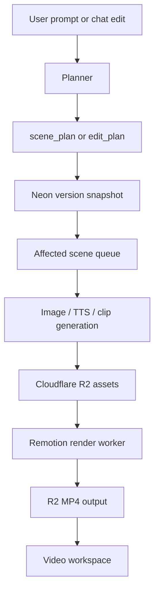

# Architecture

## Product Loop

## Why Plans First

The editor should not immediately mutate video assets after every chat message.

Instead:

1. Interpret the request.
2. Generate an `edit_plan`.
3. Show affected scenes and before/after previews.
4. Ask for confirmation.
5. Apply patch.
6. Regenerate affected assets only.
7. Render a new version.

This makes edits auditable, reversible, and cheaper.

## Render Worker Boundary

Vercel should handle orchestration, not MP4 rendering.

The render worker should:

- Fetch version and scene asset data
- Build Remotion input props
- Render MP4
- Upload output to R2
- Update `render_jobs` and `project_versions`

The production worker is packaged by `Dockerfile.renderer` for Cloud Run. Vercel creates and tracks jobs; the worker owns Chromium, Remotion and FFmpeg.

## Versioning Rules

- A project has one `current_version_id`.
- Every accepted edit creates a new `project_versions` row.
- Scenes are copied forward, then patched.
- Assets are reused when possible.
- Unchanged scenes should not regenerate.
- Chat messages should reference the version they were made against.

## Regeneration Matrix

| User request | Regenerate |
| --- | --- |
| Change voiceover text | audio, captions, render |
| Change visual style | image, clip, thumbnail, render |
| Add scene | image, audio, clip, captions, render |
| Delete scene | render |
| Change speed | captions, render |
| Change logo | clip or render depending on composition |
