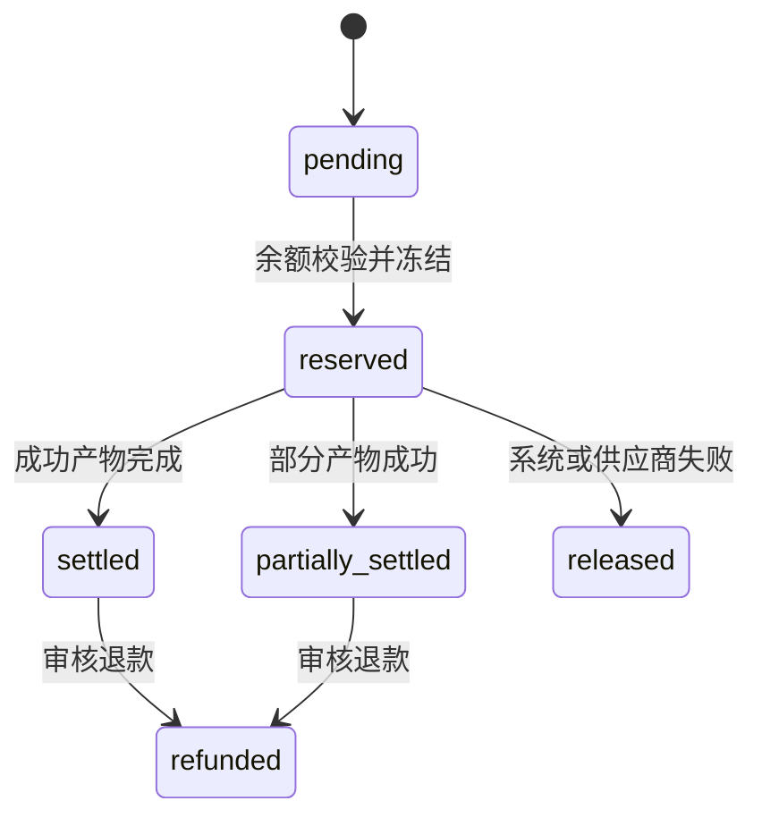

# Know Video 按使用量计费开发方案

> 状态：Draft 1  
> 更新日期：2026-08-07  
> 目标：为 Know Video 建立可审计、可调价、可退款，并能长期维持 40% 以上单位贡献毛利率的按量计费系统。

## 1. 决策摘要

Know Video 采用“算力点账户 + 按成功产物结算”的模式：

- `100 算力点 = ¥1.00`，前台只展示算力点和人民币参考值。
- 文本规划按成功请求计费，图片按成功张数计费，配音按成功秒数计费，动态镜头按成功片段计费。
- 用户确认生成时冻结最高预计点数，任务结束后按实际成功用量结算，多冻结部分立即释放。
- 供应商错误、系统错误和内部自动重试不向用户重复收费；用户主动重做属于新消费。
- MP4 导出第一阶段不单独收费，其算力成本进入平台服务费；未来成本显著增长后再独立计量。
- 定价目标为 50% 单位贡献毛利率，40% 是硬性底线，不是日常定价目标。
- 所有供应商价格、汇率、税费、风险系数和用户售价必须配置化，并保留生效时间与历史版本。

## 2. 为什么这样收费

### 2.1 用户购买的价值

用户并不是在购买一次模型 API 调用，而是在购买一个可以继续编辑和交付的结果：

1. 把模糊需求整理为脚本、分镜和旁白。
2. 为每个场景生成风格一致、内容相符的画面。
3. 自动补齐失败素材，而不是把供应商错误交给用户处理。
4. 生成配音、字幕、转场和动态镜头。
5. 保留版本、支持对话修改，并只重做受影响的素材。
6. 合成可下载的 MP4，并保存项目资产。

因此，价格应围绕“成功产物”和“可完成的视频工作流”设计，而不是把供应商成本原样转卖。计费单位也必须与用户可理解的动作对应，例如“1 张高清画面”或“1 个 3 秒动态镜头”。

### 2.2 商业合理性

- 标准图片和文字模型成本很低，但产品仍承担编排、质量检查、自动修复、存储、渲染和客服成本。
- 动态视频是当前最大可变成本，必须在调用前单独确认价格，不能隐含在免费重做中。
- 价格过低会让自动修复和售后变成亏损来源；价格过高则会让用户感觉在购买不透明的“空气点数”。
- 因此采用“低价基础工作流 + 明确定价的高成本动态能力”，并在账单中解释每一笔用量。

## 3. 当前项目成本边界

| 产品能力 | 当前实现 | 主要成本单位 | 计费建议 |
| --- | --- | --- | --- |
| 脚本、分镜、修改方案 | DeepSeek 优先，OpenAI 回退 | 输入/输出 token | 成功请求 |
| 标准场景画面 | Cloudflare FLUX.2 Klein 4B，OpenAI 回退 | 输出 tile、输入参考图 | 成功图片 |
| 高清场景画面 | Cloudflare FLUX.2 Klein 9B，OpenAI 回退 | 输出 MP、输入参考图 MP | 成功图片 |
| 视觉理解 | Cloudflare Moondream 或 OpenAI | token | 成功分析请求 |
| 中文旁白 | Azure Speech，失败后 OpenAI 回退 | 字符或音频 token | 成功音频秒数 |
| 其他旁白 | OpenAI TTS | 文本 token、音频 token | 成功音频秒数 |
| 动态镜头 | `xai/grok-imagine-video` | 输出秒数、输入图片 | 成功 3 秒片段 |
| MP4 合成 | Vercel Sandbox + Remotion | 计算时长、网络和存储 | 首期含在服务费中 |
| 项目资产 | Cloudflare R2 | GB/月、读取和出口流量 | 首期提供免费额度 |

当前代码中的动态镜头估算位于 `lib/video-cost-policy.ts`：

- 经济动态：480p、3 秒，估算供应商成本 `$0.16`。
- 均衡动态：720p、3 秒，估算供应商成本 `$0.23`。
- 现有 `Project.credits` 和页面上的 `996 credits` 仍是演示数据，不能作为真实余额来源。

价格校准参考官方文档：

- [Cloudflare Workers AI pricing](https://developers.cloudflare.com/workers-ai/platform/pricing/)
- [Cloudflare FLUX.2 Klein 9B model pricing](https://developers.cloudflare.com/workers-ai/models/flux-2-klein-9b/)
- [DeepSeek API pricing](https://api-docs.deepseek.com/quick_start/pricing/)
- [OpenAI GPT-4o mini pricing](https://developers.openai.com/api/docs/models/gpt-4o-mini)
- [OpenAI GPT-4o mini TTS pricing](https://developers.openai.com/api/docs/models/gpt-4o-mini-tts)
- [Azure Speech pricing](https://azure.microsoft.com/en-us/pricing/details/speech/)

供应商会调整价格，官方页面仅用于核对价格配置，运行时禁止抓取网页价格。

## 4. 毛利口径与定价公式

### 4.1 统一口径

本文的“利润率”指单位贡献毛利率：

```text
单位贡献毛利率 =
  (不含税收入 - 供应商成本 - 渲染成本 - 存储与流量成本 - 支付手续费 - 失败补偿准备金)
  / 不含税收入
```

固定研发、办公室和市场费用不进入单次任务毛利，但应在公司整体利润模型中另行覆盖。

### 4.2 经营目标

```text
目标单位贡献毛利率：50%
调价预警线：45%
硬性底线：40%
```

不应按 40% 直接定价。供应商调价、汇率波动、失败重试和支付费用都会侵蚀毛利，因此正常售价必须留下至少 10 个百分点缓冲。

### 4.3 完全可变成本

```text
fully_loaded_cost =
  provider_cost
  + render_cost
  + storage_and_egress_cost
  + observability_cost
  + provider_cost * retry_reserve_rate
```

首期默认值：

```text
retry_reserve_rate = 10%
payment_fee_rate = 3%
target_margin_rate = 50%
minimum_margin_rate = 40%
points_per_cny = 100
```

### 4.4 最低售价

所有收入和成本先换算为不含税人民币：

```text
minimum_net_revenue =
  fully_loaded_cost / (1 - target_margin_rate - payment_fee_rate)

retail_credits =
  ceil(minimum_net_revenue * points_per_cny / billing_step) * billing_step
```

建议 `billing_step = 5`，避免产生难理解的零碎点数。

发布价格前必须再次验证：

```text
projected_margin_rate >= 45%
```

低于 45% 禁止发布；线上滚动 30 天实际毛利低于 40% 时，自动关闭对应优惠价格并告警。

## 5. 首期价格目录

以下是 MVP 初始售价，不是永久固定价格。价格需要在真实账单和任务成功率数据到位后每月校准。

| `resource_type` | 用户动作 | 单位 | 初始售价 |
| --- | --- | --- | ---: |
| `storyboard_plan` | 生成完整脚本和分镜 | 成功请求 | 20 点 |
| `edit_plan` | 生成或调整修改方案 | 成功请求 | 5 点 |
| `vision_analysis` | 分析一个参考素材 | 成功请求 | 5 点 |
| `image_standard` | 标准场景画面或候选画面 | 成功图片 | 20 点 |
| `image_premium` | 高清场景画面或候选画面 | 成功图片 | 80 点 |
| `speech` | 旁白配音 | 成功音频秒 | 1 点，单次最低 5 点 |
| `video_economy_3s` | 480p 动态镜头 | 成功片段 | 300 点 |
| `video_balanced_3s` | 720p 动态镜头 | 成功片段 | 430 点 |
| `render_mp4` | 当前版本 MP4 合成 | 成功导出 | 首期 0 点 |
| `storage` | 项目素材存储 | GB/月 | 首期 1 GB 免费 |

### 5.1 动态镜头毛利示例

假设汇率为 `7.2 CNY/USD`，动态镜头增加 10% 失败准备金，单次渲染与观测分摊 `¥0.03`，税率按配置计算：

| 类型 | 供应商估算 | 完全成本约 | 售价 | 预计毛利 |
| --- | ---: | ---: | ---: | ---: |
| 经济动态 | `$0.16` | `¥1.30` | `¥3.00` | 约 50% |
| 均衡动态 | `$0.23` | `¥1.85` | `¥4.30` | 约 50% |

该示例说明初始售价有合理利润空间，但实际判断必须使用不含税收入、真实支付手续费和供应商账单，不能只看 `$0.16 × 汇率`。

### 5.2 30 秒视频示例

5 个场景、标准画面、30 秒旁白、智能运镜：

```text
脚本与分镜       20 点
标准画面      5 × 20 点 = 100 点
旁白配音         30 点
MP4 合成          0 点
合计             150 点（¥1.50）
```

增加一个 720p 动态镜头后总价约 `580 点（¥5.80）`。该结构让低成本用户可以先完成视频，同时对真正昂贵的动态生成单独收费。

## 6. 余额与交易模型

### 6.1 账户分层

每个用户只有一个余额账户，项目不持有余额：

```text
available_credits：可用余额
reserved_credits：任务已冻结、尚未结算
purchased_credits：充值获得，长期有效
subscription_credits：套餐赠送，按账期失效
promotional_credits：活动或补偿，有独立有效期
```

扣除顺序建议：即将过期的赠送点数、套餐点数、充值点数。

### 6.2 用量状态机



### 6.3 核心规则

1. 每个计费任务必须有唯一 `idempotency_key`。
2. 冻结、结算和退款必须在数据库事务内完成。
3. 余额不得为负，更新账户时锁定账户行。
4. 结算以成功写入并通过质量检查的产物为准，不以收到供应商 HTTP 200 为准。
5. 一次任务有多个场景时按场景结算，允许部分成功。
6. 内部自动重试沿用原用量事件，不新增用户费用。
7. 用户主动点击“重新生成”“高清画面”“生成候选”“生成动态”创建新用量事件。
8. 版本恢复、改标题、调转场和复用已有素材不产生模型费用。
9. 用户余额不足时不得先调用供应商再提示充值。

## 7. 数据库设计

### 7.1 `credit_accounts`

```sql
create table credit_accounts (
  user_id uuid primary key references users(id) on delete cascade,
  available_credits bigint not null default 0 check (available_credits >= 0),
  reserved_credits bigint not null default 0 check (reserved_credits >= 0),
  lifetime_granted bigint not null default 0,
  lifetime_purchased bigint not null default 0,
  lifetime_consumed bigint not null default 0,
  version integer not null default 0,
  created_at timestamptz not null default now(),
  updated_at timestamptz not null default now()
);
```

### 7.2 `pricing_rules`

```sql
create table pricing_rules (
  id uuid primary key default uuid_generate_v4(),
  resource_type text not null,
  provider text not null,
  model text not null,
  billing_unit text not null,
  credits_per_unit integer not null,
  provider_rate_json jsonb not null,
  exchange_rate numeric(12, 6) not null,
  retry_reserve_rate numeric(8, 6) not null,
  projected_margin_rate numeric(8, 6) not null,
  effective_from timestamptz not null,
  effective_to timestamptz,
  created_at timestamptz not null default now(),
  check (projected_margin_rate >= 0.40)
);
```

### 7.3 `usage_events`

```sql
create table usage_events (
  id uuid primary key default uuid_generate_v4(),
  user_id uuid not null references users(id),
  project_id uuid references projects(id) on delete set null,
  version_id uuid references project_versions(id) on delete set null,
  resource_type text not null,
  quantity numeric(16, 6) not null,
  provider text not null,
  model text not null,
  pricing_rule_id uuid not null references pricing_rules(id),
  estimated_cost_microusd bigint not null,
  actual_cost_microusd bigint,
  reserved_credits bigint not null,
  settled_credits bigint not null default 0,
  status text not null check (status in (
    'pending', 'reserved', 'partially_settled', 'settled', 'released', 'refunded'
  )),
  idempotency_key text not null unique,
  metadata_json jsonb not null default '{}',
  created_at timestamptz not null default now(),
  settled_at timestamptz
);
```

### 7.4 `credit_transactions`

```sql
create table credit_transactions (
  id uuid primary key default uuid_generate_v4(),
  user_id uuid not null references users(id),
  usage_event_id uuid references usage_events(id),
  transaction_type text not null check (transaction_type in (
    'grant', 'purchase', 'reserve', 'settle', 'release', 'refund', 'expire', 'adjustment'
  )),
  credit_delta bigint not null,
  available_after bigint not null,
  reserved_after bigint not null,
  description text not null,
  metadata_json jsonb not null default '{}',
  created_at timestamptz not null default now()
);
```

流水只追加、不更新、不删除；退款通过新流水冲正原交易。

## 8. 服务端模块边界

建议新增：

```text
lib/billing/catalog.ts        读取当前价格目录
lib/billing/estimate.ts       计算生成前最高预计点数
lib/billing/ledger.ts         冻结、结算、释放、退款
lib/billing/cost.ts           供应商真实成本标准化
lib/billing/margin.ts         毛利校验和调价保护
lib/billing/types.ts          Billing 类型
app/api/billing/estimate      前端询价
app/api/billing/account       余额和当月用量
app/api/billing/transactions  账单明细
```

模型调用路由不得自行修改余额。统一流程为：

```text
estimate -> reserve -> provider call -> validate asset -> settle/release
```

## 9. API 契约

### 9.1 生成前询价

```http
POST /api/billing/estimate
```

```json
{
  "projectId": "uuid",
  "items": [
    { "resourceType": "image_standard", "quantity": 5 },
    { "resourceType": "speech", "quantity": 30 }
  ]
}
```

响应：

```json
{
  "estimateId": "uuid",
  "maximumCredits": 130,
  "availableCredits": 996,
  "expiresAt": "2026-08-07T12:10:00Z",
  "breakdown": [
    { "label": "标准场景画面", "quantity": 5, "credits": 100 },
    { "label": "旁白配音", "quantity": 30, "credits": 30 }
  ]
}
```

询价最多有效 10 分钟。提交任务时必须携带 `estimateId`，服务端重新校验价格和余额。

### 9.2 账单返回原则

账单对用户展示：动作、数量、点数、项目、时间和状态。供应商、内部美元成本和毛利只在管理后台展示。

## 10. 前端交互

### 10.1 创建视频

生成按钮附近展示：

```text
预计最多消耗 150 点
实际按成功生成的画面和配音结算
```

低成本首次生成可以一次确认；包含动态镜头时必须额外确认。

### 10.2 修改视频

修改方案本身显示方案费用，应用方案前显示受影响素材费用：

```text
修改方案                5 点
重新生成 2 张标准画面   40 点
重新生成 1 段旁白        7 点
预计最多               52 点
```

只改标题、顺序、时长、字幕样式或复用现有素材时明确显示 `0 点`。

### 10.3 任务结果

```text
预计冻结 150 点
实际结算 130 点
已退回 20 点
```

不使用“生成失败，请再次付费重试”作为默认处理。系统错误应自动释放余额并提供免费重试入口。

## 11. 套餐与点数包

按量计费是底层结算方式，套餐只是点数来源和权益包：

| 套餐 | 建议月费 | 月度点数 | 说明 |
| --- | ---: | ---: | --- |
| Free | ¥0 | 注册赠送 1,000 点 | 一次性体验额度 |
| Creator | ¥49 | 6,000 点/月 | 个人创作者 |
| Pro | ¥159 | 22,000 点/月 | 高频创作与更高并发 |
| Team | ¥499 | 80,000 点/月 | 团队共享余额与成员权限 |

套餐点数价格必须经过相同毛利压力测试。若折扣后的预期毛利低于 45%，不得上线该套餐。

充值点数长期有效；套餐点数按账期失效；补偿点数设置独立有效期。具体有效期和退款规则上线前需经过法务与财务确认。

## 12. 毛利监控

管理后台至少提供：

- 按供应商、模型、资源类型统计调用量和成本。
- 预计成本与账单实际成本的偏差。
- 成功率、自动重试率、退款率和免费补偿率。
- 每个资源类型的收入、完全可变成本和贡献毛利率。
- 每个套餐、用户群和项目类型的毛利率。
- 汇率变化对未来 30 天毛利的影响。

告警规则：

```text
单项 7 日毛利 < 45%：预警，要求检查成本或价格
单项 30 日毛利 < 40%：严重告警，停止促销并限制亏损档位
成本估算偏差 > 15%：暂停自动调价，检查计量口径
失败或退款率 > 8%：优先修复质量，不能简单提价掩盖问题
```

## 13. 安全与审计

- 所有计费写操作只能在服务端执行。
- 回调必须验证签名，并校验任务、用户、项目和版本关系。
- 供应商请求 ID、模型、输出数量和耗时写入 `usage_events.metadata_json`。
- 管理员调账需要操作者、原因和关联工单。
- 价格规则发布和回滚必须记录审计日志。
- 用户删除项目不删除财务流水，只移除项目内容并保留必要的账单关联字段。

## 14. 分阶段实施

### Phase 1：计量但不扣费

- 新增价格目录和 `usage_events`。
- 为文本、图片、TTS、动态镜头和导出记录实际用量。
- 对账供应商账单，校准成本估算。
- 页面展示模拟账单，但继续使用赠送点数。

验收标准：连续 14 天估算成本与供应商账单偏差不超过 10%。

### Phase 2：冻结与结算

- 新增账户和不可变流水。
- 接入询价、冻结、部分结算、释放和退款。
- 所有高成本生成路由强制经过 Billing Service。
- 上线余额不足和用量明细页面。

验收标准：并发与重试测试中无重复扣费、负余额或未释放冻结余额。

### Phase 3：充值与套餐

- 接入支付渠道、充值点数和月度套餐点数。
- 增加发票、退款、过期和管理后台调账。
- 建立按模型和套餐的毛利看板。

验收标准：30 天滚动贡献毛利率稳定高于 45%，任何资源类型不得低于 40%。

## 15. 暂不实施

- 不按项目时长粗暴统一收费。
- 不把失败的供应商调用直接转嫁给用户。
- 不在前端直接计算最终扣费金额。
- 不依赖 `Project.credits` 作为余额真相来源。
- 不把免费额度当成零成本；免费用户消耗也必须记入成本账。
- 不在没有真实成本与成功率数据前承诺“无限生成”。

## 16. 上线前检查清单

- [ ] 所有生成入口都有服务端询价和余额校验。
- [ ] 所有计费请求都有唯一幂等键。
- [ ] 供应商失败和内部重试不会重复扣费。
- [ ] 部分成功可以按场景结算并释放余款。
- [ ] 价格规则保存供应商单价、汇率和生效时间。
- [ ] 预计毛利低于 45% 的价格不能发布。
- [ ] 实际毛利低于 40% 会触发严重告警和止损动作。
- [ ] 用户可以查看项目级用量明细和退款记录。
- [ ] 财务可以用不可变流水重建任意时点余额。
- [ ] 免费用户、赠送点数和人工补偿均进入完整成本统计。

